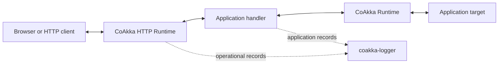
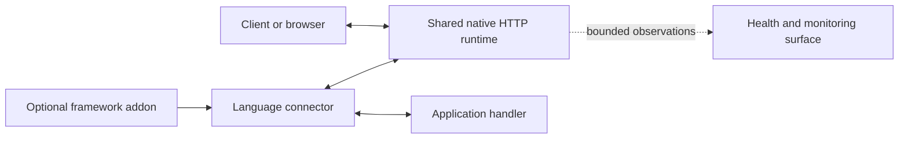
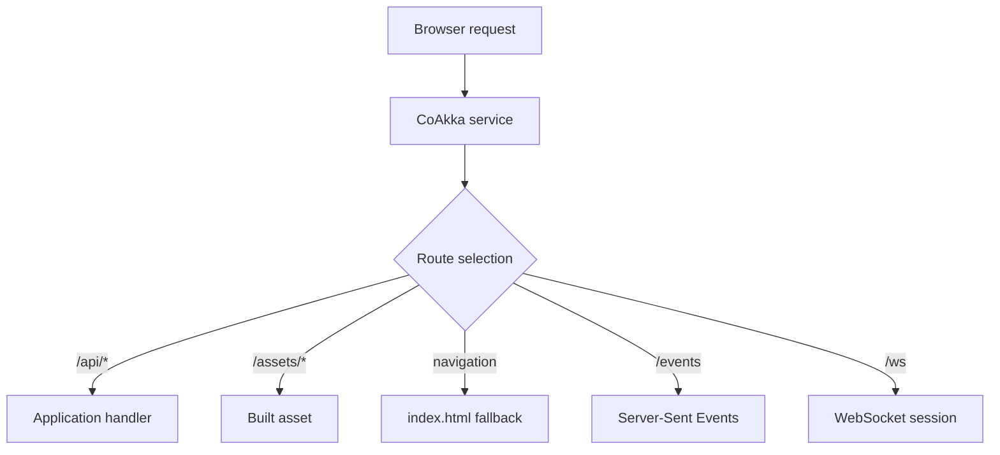
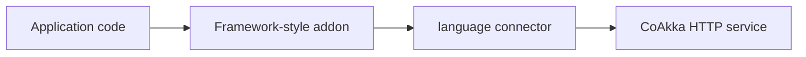

# CoAkka HTTP Runtime

**One HTTP runtime. Familiar programming in every supported language.**

CoAkka HTTP Runtime lets C, C++, Java, Kotlin, Python, JavaScript, TypeScript,
and Go build HTTP services with the programming style developers already use
in that ecosystem. It can serve backend APIs, built frontend files, streams,
server events, and WebSocket sessions while making capacity, pressure,
health, monitoring, live handler changes, and shutdown explicit.

Applications use the normal service path for their language. Handlers execute
in the App Host using its native values and scheduling model; users do not have
to choose an execution mode.

CoAkka HTTP Runtime supplies one shared HTTP contract. Language packages
project it through each App Host without changing how application handlers are
written.

The shared part is a **native HTTP implementation**, not just similarly named
APIs over unrelated language servers. Transport, parsing, routing, limits,
timeouts and shutdown are maintained in one place. A fix or optimization there
can benefit every connector that ships the updated runtime; each language
keeps its own handler style, scheduling and boundary costs.

Version `1.0.0` is distributed through this repository as checksum-pinned
archives with synchronized documentation and samples. The earlier native package layout is superseded and is not
the installation baseline for this train. Do not use an older archive with
the new APIs.

Native, JVM, Go, JavaScript, and Python local package candidates have completed
their recorded platform checks and artifact-backed sample synchronization.
The optional Inspect application has two separately qualified packages.
Distribution uses repository files, not a GitHub Release. There is no HTTP
Runtime publication to npm, Maven, PyPI or Go package repositories in this train.

## Package Files

| Application language | Package directory | Archives |
| --- | --- | ---: |
| C/C++ | [Native candidate](native/candidates/2026-10-08-r3/) | 5 |
| Go | [Go candidate](go/candidates/2026-10-08-r3/) | 5 |
| Java/Kotlin | [JVM candidate](jvm/candidates/2026-10-08-r3/) | 5 |
| Node.js/Bun/TypeScript | [JavaScript candidate](javascript/candidates/2026-10-08-r3/) | 5 shared packages |
| Python | [Python candidate](python/candidates/2026-10-08-r3/) | 5 |
| Optional inspection application | [Inspect guide and packages](inspect/README.md) | 2: macOS ARM64, Linux ARM64 |

Each available directory includes `SHA256SUMS`. Node.js and Bun use the same
JavaScript package, not separate downloads. These are repository archives, not
registry releases. From this checkout, verify the admitted archives with:

```sh
bash scripts/verify-http-runtime-release.sh --all-candidates
```

This checks archive bytes and payload checksums; it does not execute the service
or establish deployment capacity.

## Contents

- [Package Files](#package-files)
- [Why CoAkka HTTP Runtime Exists](#why-coakka-http-runtime-exists)
- [Where It Fits In CoAkka](#where-it-fits-in-coakka)
- [Start With Familiar Code](#start-with-familiar-code)
- [Application Model](#application-model)
- [What It Supports](#what-it-supports)
- [Frontend And Backend In One Service](#frontend-and-backend-in-one-service)
- [Queues And Backpressure](#queues-and-backpressure)
- [Observability And Monitoring](#observability-and-monitoring)
- [TLS, mTLS, And Live Handler Changes](#tls-mtls-and-live-handler-changes)
- [Framework Experiences Belong In Addons](#framework-experiences-belong-in-addons)
- [Compare With Familiar Platforms](#compare-with-familiar-platforms)
- [Languages And Hosts](#languages-and-hosts)
- [Benchmark Policy](#benchmark-policy)
- [Documentation](#documentation)
- [Release Status](#release-status)

## Why CoAkka HTTP Runtime Exists

HTTP server work is fragmented. Each language grows its own routing,
streaming, overload, monitoring, and shutdown conventions. Improvements made
for one host rarely benefit another, and operational behavior drifts as a
system becomes polyglot.

CoAkka keeps two things together:

- one shared HTTP contract for routing, bounds, pressure, lifecycle, health,
  monitoring, files, streaming, and realtime work;
- an idiomatic language connector so application code still feels like Go,
  Kotlin, Java, Python, JavaScript, TypeScript, C, or C++.

The goal is not to make every language look identical. The goal is to give
each language a strong native experience without rebuilding the operational
contract from zero.

Sharing the implementation reduces repeated transport work across languages:
one parser correction, resource-policy fix or hot-path optimization can be
carried into every language package using that runtime generation. Users still
need to adopt the updated package; installed services do not upgrade
automatically. It also does not make Python, Go, JVM and JavaScript scheduling
or throughput identical.

For the complete rationale and capability overview, read
[Introducing CoAkka HTTP Runtime](../docs/coakka-http-runtime-introduction.md).

## Where It Fits In CoAkka

CoAkka HTTP Runtime is the HTTP product in the wider CoAkka ecosystem. It can
run independently as a frontend/backend service. In a larger system, a handler
can also send application work through CoAkka Runtime and emit operational
records through `coakka-logger`; each product keeps its own ownership,
lifecycle, and release identity.



## Start With Familiar Code

```javascript
import { Builder, Response } from "@coakka/http";

const service = new Builder()
  .listen("127.0.0.1", 3000)
  .get("/api/hello", () => Response.text("Hello from CoAkka"))
  .get("/health", () => Response.text("ok"))
  .start();

console.log(`http://127.0.0.1:${service.port}`);
```

The handlers are ordinary JavaScript functions. CoAkka adds the service
contract around them: frozen routes, bounded admission, typed pressure,
health, monitoring, cancellation, and finite close. Streaming, realtime,
outbound, TLS/mTLS, handler swap, and full monitor control are available
through the complete `CoAkka HTTP Runtime` surface in the same package.

See the same shape in [C/C++](native/README.md),
[Java/Kotlin](jvm/README.md), [Python](python/README.md),
[JavaScript/TypeScript](javascript/README.md), and [Go](go/README.md).

## Application Model

An **App Host** is the process environment running application code, such as a
JVM, CPython, Node.js, Bun, Go, or a native process. A connector maps CoAkka's
service contract into that host's normal handlers, values and concurrency.
The shared runtime owns HTTP transport; no second host-native HTTP server is
required.



Startup freezes and validates the service declaration before listening. On
each request, the connector projects bounded HTTP values into the App Host,
invokes the application handler there, and returns the response through the
same service. The App Host keeps ownership of business state and application
scheduling; `CoAkka HTTP Runtime` keeps ownership of its HTTP resources,
limits, protocol state, operational truth, and ordered shutdown.

Read [How It Works](docs/how-it-works.md) and
[App Host And Connectors](docs/app-host-and-connectors.md) for the lifecycle and
ownership diagrams.

## What It Supports

| Area | Public service contract |
| --- | --- |
| Server and routing | HTTP/1.1, HTTP/2, HTTP/3 where available, method/path routing, captures, query values, headers, forms, multipart, route rebinding |
| Responses | Buffered text, bytes and JSON, streamed bodies, headers, status, cancellation |
| Realtime | Server-Sent Events and WebSocket sessions |
| Frontend delivery | Static files, index files, cache policy, byte ranges, validators, and SPA fallback |
| Outbound HTTP | Service-owned client surface with bounded lifecycle |
| Capacity | Finite connections, active handlers, bodies, chunks, routes, sessions, diagnostics, and retained bytes |
| Backpressure | Explicit rejection or pause/resume behavior instead of unbounded accumulation |
| Observability | Non-blocking health, fresh liveness probes, coherent snapshots, typed failures, route generation, pressure and lifecycle truth |
| Monitoring | Startup-reserved aggregates and event history, cursor reads, missed-event counts, coalesced notification, live policy updates, and finite wait/interrupt |
| Security | Feature-gated TLS and mutual TLS with file-backed identity/trust configuration and fail-closed validation |
| Live change | Generation- and revision-checked handler swap without dropping already-admitted work |
| Linux I/O | Platform-default backend plus explicit `io_uring` for supported HTTP/2 and HTTP/3 configurations |

The [capability matrix](docs/capabilities.md) records the exact per-language
surface. An API name by itself is not evidence that every host implements the
same mechanism.

## Frontend And Backend In One Service

CoAkka can serve a built React, Vue, Svelte, or plain HTML application beside
its APIs and realtime routes. It serves the frontend build; it does not replace
the frontend framework.



Application routes take precedence over static fallback. File roots, active
files, byte counts, and cache behavior remain explicit and bounded. See
[Frontend And Backend](docs/frontend-and-backend.md).

## Queues And Backpressure

CoAkka makes overload visible instead of quietly growing memory:

- connection, active-handler, body, stream, session, and retained-byte
  capacities are finite;
- connectors with dispatch queues bound both item count and retained bytes;
- stream readers and writers pause or reject at declared limits;
- pressure, timeout, cancellation, closed state, and application failure stay
  distinguishable;
- shutdown stops admission, converges accepted work, interrupts waiters, and
  finishes within a caller-owned deadline.

Not every host uses the same queue. The exact mechanism may be a finite worker
queue, active-exchange admission, or stream writability, while the public law
stays the same: retained work is bounded and pressure is visible.

## Observability And Monitoring

Observability and monitoring are related, but they are not synonyms in CoAkka.

- **Observability** is the truth the service can expose: health, a fresh
  liveness probe, counters, active and retained work, typed pressure outcomes,
  route/binding generation, latency buckets, and lifecycle state.
- **Monitoring** is the bounded facility that collects selected aggregates and
  recent operational events, then lets an operator poll, wait, read by cursor,
  and detect overwritten history.

The monitor is built into `CoAkka HTTP Runtime`, projected by the Go, JVM,
Python, JavaScript, TypeScript, C, and C++ surfaces, and disabled by default so
collection cost is explicit. Event saturation never blocks HTTP traffic or
changes an exchange result. Request bodies, credentials, cookies, certificate
material, and arbitrary application labels are not retained.

Read [Observability And Monitoring](docs/observability-and-monitoring.md) for
the data model, monitor channel, operational loop, and language API map.

## TLS, mTLS, And Live Handler Changes

CoAkka supports plaintext, server-authenticated TLS, and mutual TLS. Listener
identity, trust roots, credential identity, and credential generation are
copied and validated at startup; invalid or unsupported combinations fail
before the service reports ready.

A running service can also switch one route to a prepared handler binding by
supplying the expected route generation and current binding revision. Requests
already admitted continue on the binding they captured, while new requests use
the accepted revision. Replayed activation identifiers are idempotent, and a
stale update is rejected without partially changing the route.

See [TLS And mTLS](docs/tls-and-mtls.md) and
[Handler Swap And Hot Reload](docs/handler-swap-and-hot-reload.md). The atomic
binding change is the runtime foundation for hot reload. Source watching,
compilation, module loading, and deployment policy stay in the App Host or an
addon.

## Framework Experiences Belong In Addons

CoAkka is not limited to its builder API. A Spring-like, decorator-driven,
middleware-driven, generated, or domain-specific experience belongs above the
connector as an addon.



This lets richer developer experiences evolve without weakening CoAkka's
capacity, pressure, monitoring, or shutdown contract. Addons can advance
independently above the stable connector boundary.

## Compare With Familiar Platforms

The comparison snapshot is dated **2026-09-13**. It is a mental-model map, not
a feature score and not benchmark evidence.

| Ecosystem | Comparisons |
| --- | --- |
| JavaScript | [Node.js](docs/comparisons/nodejs.md), [Bun](docs/comparisons/bun.md) |
| JVM | [Spring Boot](docs/comparisons/spring-boot.md), [Netty](docs/comparisons/netty.md), [Tomcat](docs/comparisons/tomcat.md), [Jetty](docs/comparisons/jetty.md) |
| Go | [`net/http`](docs/comparisons/go-net-http.md), [Chi](docs/comparisons/chi.md), [Gin](docs/comparisons/gin.md) |
| Python | [FastAPI and Uvicorn](docs/comparisons/fastapi-uvicorn.md) |

Start with the [comparison index](docs/comparisons/README.md) or the
[cross-platform snapshot](docs/comparison-2026-09-13.md).

## Languages And Hosts

| Language | App Host | Developer surface |
| --- | --- | --- |
| C | Native process | Explicit service lifecycle through the public host API |
| C++ | Native process | The same stable host API from C++20 |
| Java | JVM | `ServiceBuilder`, Java handlers, and JVM-owned values |
| Kotlin | JVM | Idiomatic builder calls, handlers, and typed events |
| Python | CPython | Buffered or streaming handlers plus typed events and context-managed ownership |
| JavaScript | Node.js or Bun | Synchronous or asynchronous handlers plus typed events |
| TypeScript | Node.js or Bun | The JavaScript surface with declarations |
| Go | Go process | Builder, ordinary functions, Go-owned values, and typed runtime control |

The rebuilt candidate target matrix covers macOS ARM64, Linux ARM64, Linux
x86-64, Windows ARM64, and Windows x86-64. Exact host floors and verified
capabilities belong in each language guide.

## Benchmark Policy

Every language comparison measures the same public service path that an
application normally uses.

- Every CoAkka lane uses its public host-inlined application surface.
- Comparisons use frameworks developers actually choose in the same ecosystem;
  language-standard HTTP servers are intentionally excluded.
- Source, package identity, host state, raw output, p99, CPU, memory, and
  shutdown evidence accompany every number.
- Linux `io_uring` is measured as a same-language HTTP/2 TLS A/B against the
  platform-default backend. It is not mixed into HTTP/1.1 framework rankings.
- A result without verified application-path identity is invalid, even if the
  command ran successfully.

See the [Raspberry Pi 5 protocol](docs/benchmark-rpi5.md) and the
[result status](docs/benchmark-results-rpi5.md).

## Documentation

| Guide | Purpose |
| --- | --- |
| [How It Works](docs/how-it-works.md) | Request, pressure, monitoring, and lifecycle flow |
| [App Host And Connectors](docs/app-host-and-connectors.md) | Responsibilities, ownership, and addon boundary |
| [Frontend And Backend](docs/frontend-and-backend.md) | Static build, APIs, SSE, and WebSocket in one service |
| [Capabilities](docs/capabilities.md) | Exact feature state by host |
| [Operations](docs/operations.md) | Bounds, pressure, health, monitoring, and shutdown |
| [Observability And Monitoring](docs/observability-and-monitoring.md) | Health, liveness, aggregates, event channel, loss, and operator integration |
| [TLS And mTLS](docs/tls-and-mtls.md) | Installation, listener identity, trust, protocol selection, and samples |
| [Handler Swap And Hot Reload](docs/handler-swap-and-hot-reload.md) | Atomic handler activation, generation checks, draining, and reload ownership |
| [Comparisons](docs/comparisons/README.md) | Dated platform-by-platform maps |
| [Raspberry Pi 5 Benchmark](docs/benchmark-rpi5.md) | Reproducible application benchmark protocol |
| [Raspberry Pi 5 Results](docs/benchmark-results-rpi5.md) | Current result status and measured-machine record |
| [Native](native/README.md) | C and C++ usage |
| [JVM](jvm/README.md) | Java and Kotlin usage |
| [Python](python/README.md) | Python usage |
| [JavaScript](javascript/README.md) | Node.js, Bun, and TypeScript usage |
| [Go](go/README.md) | Go usage |
| [HTTP Runtime Inspect](inspect/README.md) | Local browser inspection, packages, security and lifecycle |

## Release Status

The branch contains 25 service-package candidates and two independently
qualified Inspect candidates. Exact package identities, platform evidence,
documentation and consumer samples are checked together before the three
repository branches merge. Old benchmark results do not qualify a new package.
Inspect is restricted to the two platforms and local development scope in its
guide. Registry upload and production signing are outside this preparation step.
