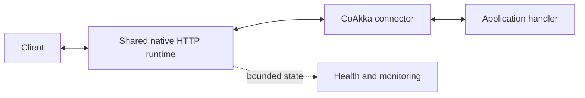
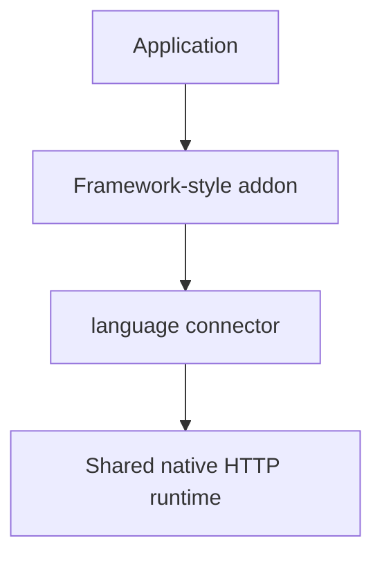

# App Host And Connectors

This document defines the public application boundary used by applications,
samples, and benchmarks.

## Contents

- [App Host](#app-host)
- [Language Connector](#language-connector)
- [Shared CoAkka Foundation](#shared-coakka-foundation)
- [Addon](#addon)
- [Ownership](#ownership)
- [Concurrency And Capacity](#concurrency-and-capacity)
- [Choosing A Surface](#choosing-a-surface)

## App Host

The **App Host** is the environment where user code executes.

| Language | App Host |
| --- | --- |
| Java and Kotlin | JVM process |
| Python | CPython process |
| JavaScript and TypeScript | Node.js or Bun process |
| Go | Go process |
| C and C++ | Native process |

The App Host owns business state, handlers, downstream clients, database pools,
caches, and any application executor. Its normal values and scheduling model
remain visible to the developer.

## Language Connector

The connector is the only public application path for a language package. It:

- presents idiomatic builders, requests, responses, errors, and lifecycle;
- submits route and resource declarations for runtime validation before ready;
- starts the configured CoAkka HTTP service and projects its values;
- executes application handlers inside the App Host;
- preserves runtime-issued bounds and enforces the language boundary's own
  memory-safety, lifetime and scheduling limits;
- exposes pressure, health, inspection, monitoring, cancellation, and finite
  close without asking users to select a runtime mode.

Applications use the CoAkka service shown here. The App Host remains the owner
of user code; it does not need to reimplement the shared HTTP runtime.

## Shared CoAkka Foundation

`CoAkka HTTP Runtime` owns the shared CoAkka contract and reusable native
foundation: route admission rules, stable result meanings, bounded-resource
policy, lifecycle law, health/monitoring vocabulary, and native C/C++ service
capabilities.

The shared implementation owns HTTP transport, parsing, route matching,
configuration defaults, effective state and terminal outcomes. Connectors
must not infer these facts or repeat the same validation policy in each
language. An improvement here can benefit all language packages that adopt
the updated runtime; host scheduling and value conversion remain distinct.

Language connectors project that contract into their App Host. The foundation
does not force JavaScript to look like C or Go to look like the JVM. Each
language keeps one idiomatic application model.

## Addon

An addon changes developer experience above the connector. Examples include
annotations, decorators, middleware conventions, generated routes, validation,
serialization, dependency injection, and application-specific security.

A Spring-like or Gin-like experience can therefore be added without creating a
separate operational contract for pressure, monitoring, and shutdown.

## Ownership

| Boundary | Owner and rule |
| --- | --- |
| Builder | Application owns it until `start`; start freezes it and is single-use |
| Listener/service | Runtime owns HTTP resources; the application owns the language service handle and initiates close through the connector |
| Buffered request | Connector projects a bounded request value; borrowed native views obey their callback lifetime |
| Request stream | The current reader owns consumption and must honor cancellation |
| Response stream | Producer owns its source and must stop on cancellation or close |
| WebSocket session | Service owns the session lifecycle; application owns its callbacks/state |
| Monitoring | Snapshot reads are independent; one blocking waiter owns the bounded event channel |
| Shutdown | Application requests close; runtime owns transport drain and terminal state, connector retires language-owned resources according to that outcome |

## Concurrency And Capacity

Using a language's normal application model does not mean accepting unbounded
work. CoAkka follows the host's natural execution model while applying explicit
limits.

| Host | Normal execution shape |
| --- | --- |
| JVM | JVM handlers plus bounded worker/event-reader and stream state |
| Python | Python handlers with bounded workers, admission, body, and stream state |
| Node.js/Bun | JavaScript event loop plus runtime readers/workers; blocking application work stays off the main loop |
| Go | Normal handlers and goroutines with finite connections and active handlers |
| Native | Explicit application callbacks and configured native capacity |

Applications must also bound downstream pools and queues. A connector cannot
prevent an application handler from creating unbounded goroutines, tasks, or
database work after dispatch.

## Choosing A Surface

Use the language convenience builder for normal buffered request/reply.

Use the complete runtime owner in the same package for streaming, frontend files,
server events, WebSockets, outbound HTTP, TLS/mTLS, handler swap, health,
liveness, inspection, and the monitor channel.

Use an addon when the team wants framework conventions above that service.

Use native C/C++ directly when the application host itself is native.

Continue with [How It Works](how-it-works.md),
[Frontend And Backend](frontend-and-backend.md), or the
[language guides](../README.md#languages-and-hosts).
