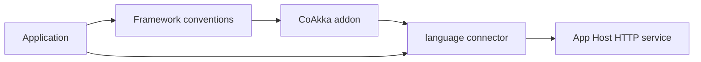

# Platform Comparison Snapshot

Comparison date: **2026-09-13**.

This is a mental-model map. It helps developers place CoAkka beside familiar
servers and frameworks; it is not a feature score and contains no performance
claim.

## Contents

- [How To Read This](#how-to-read-this)
- [Programming Model](#programming-model)
- [Operational Model](#operational-model)
- [Where Addons Fit](#where-addons-fit)
- [Benchmark Boundary](#benchmark-boundary)

## How To Read This

The rows describe different layers. Netty, Tomcat, Jetty, Node.js, Bun, and
Uvicorn include server/runtime roles. Spring Boot, Gin, Chi, FastAPI, and other
frameworks add application conventions. CoAkka provides a CoAkka service
contract and can accept framework-style addons above it.

## Programming Model

| Platform | Familiar application shape | CoAkka relationship |
| --- | --- | --- |
| CoAkka HTTP Runtime | Builder, routes, handlers, response values | idiomatic API in each supported language |
| Node.js | Request listener and streams | CoAkka keeps JavaScript handlers and adds routes, bounds, health, and lifecycle |
| Bun | `Bun.serve`-style handlers | CoAkka keeps the Bun host experience through its application package |
| Netty | Channel pipeline and event loops | CoAkka JVM provides an application service above low-level pipeline work |
| Tomcat | Servlet container | CoAkka JVM uses handlers directly; servlet conventions can be an addon |
| Jetty | Server/handler or servlet model | CoAkka JVM offers a direct service; Jetty-style integration can be an addon |
| Spring Boot | Annotated application framework | Spring-like annotations and dependency injection belong in an addon |
| Go `net/http` | `Handler` and `ServeMux` | CoAkka Go keeps normal Go values and adds its bounded service contract |
| Chi | Composable Go router/middleware | CoAkka provides its own route contract; Chi-style middleware can be adapted above it |
| Gin | Go engine/context framework | CoAkka uses typed request/response values; Gin-like convenience can be an addon |
| FastAPI/Uvicorn | Python annotations plus ASGI server | CoAkka Python keeps ordinary synchronous callables; decorator/schema experience belongs in an addon |

## Operational Model

| Concern | CoAkka position |
| --- | --- |
| Native developer experience | Handler stays inside its App Host and uses host-language values |
| Capacity | Connections, active handlers, bodies, streams, sessions, and diagnostics are finite |
| Backpressure | Explicit refusal or pause/resume at the boundary that is full |
| Monitoring | Every complete runtime connector exposes health, fresh liveness, bounded aggregates, cursor-based events, loss accounting, live policy, wait, and interrupt |
| Frontend delivery | Built assets, index files, and SPA fallback beside APIs and realtime routes |
| Lifecycle | Frozen startup, cancellation, idempotent close, and finite convergence |
| Framework experience | Optional addon above the language connector |

This table does not imply that the competitors lack these features. Their
mechanisms and defaults differ, and those differences belong in the individual
comparison pages and runnable source.

## Where Addons Fit

CoAkka's current builder is already a usable programming model. Addons extend
that experience; they are not a workaround for an incapable runtime.

## Benchmark Boundary

Architecture tables do not prove speed. Every CoAkka measurement runs the same
public host-inlined service path used by normal applications. Each language is
compared only with the named frameworks developers commonly choose in that
ecosystem; language-standard HTTP servers are intentionally excluded.

Source, versions, raw results, p99 latency, CPU, memory, host state, and
shutdown evidence accompany every number. A separate HTTP/2 TLS pair measures
platform-default versus explicit `io_uring` without mixing backend results into
the HTTP/1.1 framework tables.

See the [comparison index](comparisons/README.md) and
[Raspberry Pi 5 protocol](benchmark-rpi5.md).
