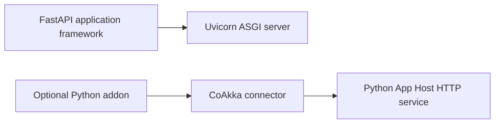

# CoAkka HTTP Runtime And FastAPI/Uvicorn

**Compared: 2026-09-13.** Scope: CoAkka HTTP Runtime `1.0.0` and the FastAPI
and Uvicorn documentation current on the comparison date.

## Contents

- [The Familiar Shape](#the-familiar-shape)
- [The CoAkka Shape](#the-coakka-shape)
- [Two Products In The Familiar Stack](#two-products-in-the-familiar-stack)
- [Mental Model](#mental-model)
- [Choose By Responsibility](#choose-by-responsibility)
- [Official References](#official-references)

## The Familiar Shape

```python
from fastapi import FastAPI

app = FastAPI()


@app.get("/api/hello")
async def hello() -> dict[str, str]:
    return {"message": "Hello from FastAPI"}
```

FastAPI supplies decorators, validation, serialization, generated API schema,
and application-level features. Uvicorn runs the ASGI application and supplies
server settings such as concurrency, backlog, workers, timeouts, and graceful
shutdown.

## The CoAkka Shape

```python
import asyncio

from coakka_http import Builder, Response


async def hello(_request) -> Response:
    return Response.text("Hello from CoAkka")


async def main() -> None:
    service = await Builder().get("/api/hello", hello).start()
    try:
        await service.wait()
    finally:
        await service.close()


asyncio.run(main())
```

The route is an ordinary async Python function. The language connector keeps
handler execution in the Python App Host and owns the bounded CoAkka service
lifecycle.

## Two Products In The Familiar Stack

FastAPI and Uvicorn have separate responsibilities. Comparing only CoAkka with
FastAPI would omit the ASGI server; comparing only CoAkka with Uvicorn would
omit the framework experience.



## Mental Model

| FastAPI/Uvicorn | CoAkka HTTP Runtime |
| --- | --- |
| Decorated path operation | Builder route today; decorators may live in an addon |
| Pydantic validation and serialization | Application or addon responsibility |
| ASGI application | CoAkka Python connector |
| Uvicorn server process | CoAkka service inside the Python App Host |
| Uvicorn concurrency and backlog controls | CoAkka connection, active-handler, body, and stream bounds |
| Framework health/metrics integration | CoAkka health, monitor snapshots/events, plus application telemetry |

Uvicorn documents a concurrency limit that returns HTTP `503` when capacity is
exceeded and a bounded graceful-shutdown timeout. CoAkka also makes pressure
and shutdown explicit, but its capacity model spans connections, exchanges,
retained bytes, streams, sessions, diagnostics, and shutdown.

## Choose By Responsibility

Choose FastAPI with Uvicorn for its Python-first async ecosystem, decorators,
validation, generated API documentation, and ASGI integrations.

Choose CoAkka when Python should share HTTP, pressure, monitoring, and lifecycle
semantics with JVM, JavaScript, Go, or native services. A Python addon can add
decorators and validation above the connector without moving HTTP ownership.

## Official References

- [FastAPI first steps](https://fastapi.tiangolo.com/tutorial/first-steps/)
- [FastAPI tutorial](https://fastapi.tiangolo.com/tutorial/)
- [Uvicorn settings and resource limits](https://www.uvicorn.org/settings/)
- [CoAkka Python guide](../../python/README.md)
- [CoAkka App Host And Connectors](../app-host-and-connectors.md)
