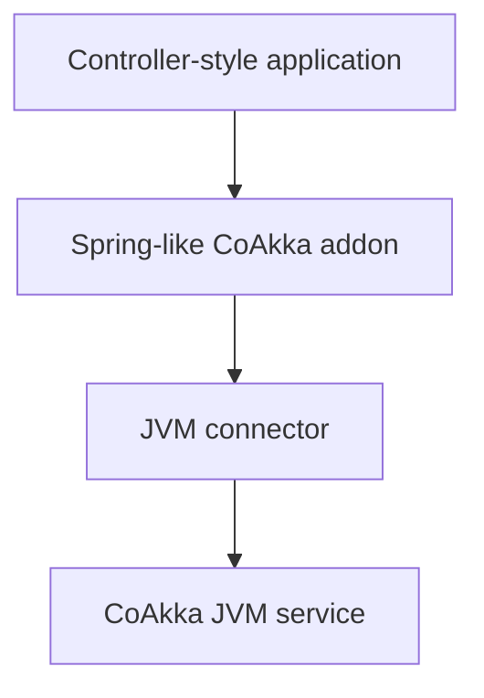

# CoAkka HTTP Runtime And Spring Boot

**Compared: 2026-09-13.** Scope: CoAkka HTTP Runtime `1.0.0` and Spring Boot
`4.1.1`, the current stable line shown by the official documentation on the
comparison date.

## Contents

- [The Familiar Shape](#the-familiar-shape)
- [The CoAkka Shape Today](#the-coakka-shape-today)
- [Where An Addon Fits](#where-an-addon-fits)
- [Mental Model](#mental-model)
- [Choose By Responsibility](#choose-by-responsibility)
- [Official References](#official-references)

## The Familiar Shape

Spring Boot applications commonly express HTTP endpoints as controllers:

```java
@RestController
class HelloController {
    @GetMapping("/api/hello")
    String hello() {
        return "Hello from Spring";
    }
}
```

Spring Boot supplies application composition, dependency injection,
configuration, production features, and an embedded server selected by the
application.

## The CoAkka Shape Today

```kotlin
val service = ServiceBuilder()
    .listen("127.0.0.1", 3000)
    .get("/api/hello", Handler { Responses.text("Hello from CoAkka") })
    .start()
```

The current CoAkka builder keeps route-and-handler code direct. Controller
annotations, dependency injection, validation, and generated bindings fit in
addons above that builder when an application wants a Spring-like experience.

## Where An Addon Fits



A framework-style addon may translate annotations, validation, generated
routes, and dependency injection into the connector. The connector keeps
owning finite HTTP capacity, pressure outcomes, health, monitoring, and
shutdown while addon packages follow their own release cadence.

## Mental Model

| Spring Boot | CoAkka HTTP Runtime |
| --- | --- |
| Controller annotation | Builder route today; addon mapping in the future |
| Spring bean/application context | App Host and optional addon responsibility |
| Embedded server selected by starter | CoAkka JVM service |
| Actuator and metrics integrations | CoAkka health, monitor snapshots/events, plus application telemetry |
| Framework configuration | Connector configuration plus addon policy |
| Java/Kotlin application | Same, with the HTTP runtime also shared outside the JVM |

Spring Boot is a broad application framework. CoAkka HTTP Runtime is an
operational HTTP runtime with connectors and an addon boundary. They are not
the same category, and neither category makes the other unnecessary.

## Choose By Responsibility

Choose Spring Boot when the application wants Spring's complete programming
model, ecosystem, dependency injection, data stack, and production integration.

Choose CoAkka when the organization wants one bounded HTTP and monitoring
contract across JVM, Python, JavaScript, Go, and native services. Use an addon
when JVM teams also want higher-level conventions above that shared contract.

## Official References

- [Spring Boot documentation](https://docs.spring.io/spring-boot/)
- [Spring Boot embedded web servers](https://docs.spring.io/spring-boot/how-to/webserver.html)
- [Spring Boot Servlet applications](https://docs.spring.io/spring-boot/reference/web/servlet.html)
- [CoAkka App Host And Connectors](../app-host-and-connectors.md)
