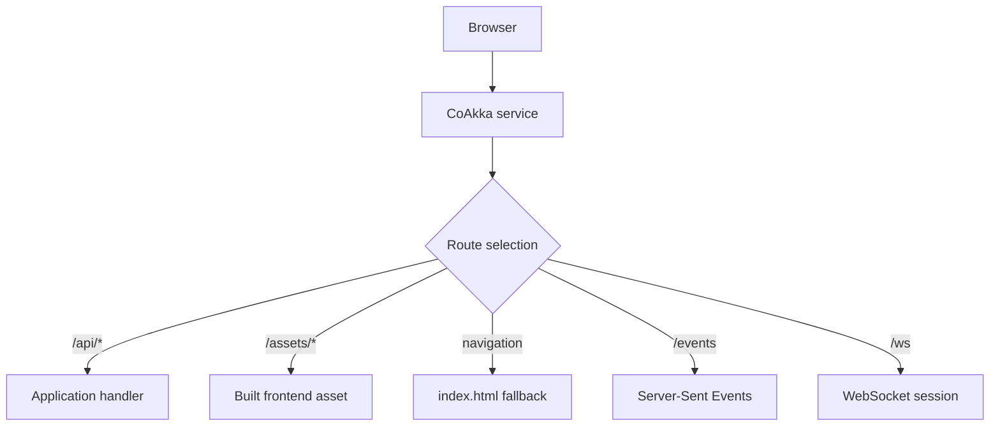

# Serve Frontend And Backend

A CoAkka service can serve a built frontend beside backend APIs, response
streams, server events, and WebSocket sessions. It serves the files produced by
React, Vue, Svelte, or another frontend tool; it does not replace that tool.

## Contents

- [Application Shape](#application-shape)
- [Routing Law](#routing-law)
- [Complete Python Example](#complete-python-example)
- [JavaScript And TypeScript](#javascript-and-typescript)
- [Kotlin](#kotlin)
- [Go](#go)
- [C And C++](#c-and-c)
- [Operational Behavior](#operational-behavior)

## Application Shape

```text
web/
  dist/
    index.html
    assets/
server/
  application code
```



One process can therefore own page delivery, APIs, streaming, and realtime
connections without a second application server.

## Routing Law

Explicit application routes are matched before a static SPA fallback. A mount
declares a URL prefix, confined filesystem root, optional index file, optional
cache header, and optional fallback file. A request path cannot escape its
declared root.

Use immutable asset names with long caching. Give `index.html` a shorter policy
when deployments need browsers to discover a new frontend version promptly.

## Complete Python Example

This is the complete service shape: `/api/health` runs a Python handler,
existing files come from `web/dist`, and unmatched browser navigation receives
`index.html`.

```python
from coakka_http import Builder, Response, StaticMount


service = (
    Builder()
    .listen("127.0.0.1", 3000)
    .get("/api/health", lambda _request: Response.text("ok"))
    .static_mount(
        StaticMount(
            url_prefix="/",
            root_path="./web/dist",
            index_file="index.html",
            cache_control="public, max-age=60",
            spa_fallback_file="index.html",
        )
    )
    .start()
)
try:
    print(f"listening on http://127.0.0.1:{service.port}")
finally:
    service.close()
```

Production code adds signal ownership and uses the ordered finite shutdown
sequence described in [Operations](operations.md).

## JavaScript And TypeScript

`Builder` accepts the same route and mount declaration as JavaScript objects:

```javascript
const service = new Builder()
  .listen("127.0.0.1", 3000)
  .get("/api/health", () => Response.text("ok"))
  .staticMount({
    urlPrefix: "/",
    rootPath: "./web/dist",
    indexFile: "index.html",
    cacheControl: "public, max-age=60",
    spaFallbackFile: "index.html",
  })
  .start();
```

The connector runs one bounded event pump for application routes. Static
responses are served inside the same service lifecycle and do not invoke the
application handler.

## Kotlin

```kotlin
val service = ServiceBuilder()
    .listen("127.0.0.1", 3000)
    .get("/api/health", Handler { Responses.text("ok") })
    .staticMount(
        StaticMount(
            urlPrefix = "/",
            rootPath = "./web/dist",
            indexFile = "index.html",
            cacheControl = "public, max-age=60",
            spaFallbackFile = "index.html",
        )
    )
    .start()
```

Java uses the same JVM values and `Service` lifecycle.

## Go

```go
runtime, err := coakkahttp.Open(coakkahttp.Config{
    Listeners: []coakkahttp.Listener{{
        ID: 1, BindAddress: "127.0.0.1", Port: 3000,
        Protocol: coakkahttp.ProtocolHTTP11,
        Security: coakkahttp.SecurityPlaintext,
    }},
    Routes: []coakkahttp.Route{{
        ID: 1, HandlerBindingID: 1,
        Method: "GET", Pattern: "/api/health",
        BodyDelivery: coakkahttp.BodyInline,
    }},
    StaticMounts: []coakkahttp.StaticMount{{
        ID: 1, URLPrefix: "/", RootPath: "./web/dist",
        IndexFile: "index.html", HasIndexFile: true,
        CacheControl: "public, max-age=60", HasCacheControl: true,
        SPAFallbackFile: "index.html", HasSPAFallbackFile: true,
    }},
})
```

After `Open`, start runtime and run one bounded event reader for Go handlers.

## C And C++

The native API adds `coakka_http_host_static_mount_t` values to the copied
service configuration before start. C and C++ use the same route precedence, confined
filesystem authority, event-reader ownership, and shutdown contract. See the
[native guide](../native/README.md).

## Operational Behavior

- startup fails closed when a root, index, fallback, or declared bound is
  invalid;
- explicit API and realtime routes win before SPA fallback;
- dotfiles remain excluded unless explicitly enabled;
- response bytes, active files, indexed files, and file work are bounded;
- range and validator behavior stays inside the same HTTP service;
- health, monitoring, pressure, and shutdown include frontend delivery;
- static/SPA support has passed on macOS ARM64, Linux x86-64, Windows ARM64, and
  Windows x86-64; Linux ARM64 remains pending on the clean Trixie host, and
  applications must still check the loaded capability and use a confined root.

For file-backed TLS, see [TLS And mTLS](tls-and-mtls.md). For limits, pressure,
and shutdown, see [Operations](operations.md).
