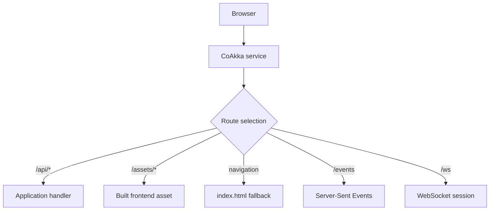

# Serve Frontend And Backend

A CoAkka service can serve a built frontend beside backend APIs, response
streams, server events, and WebSocket sessions. It serves the files produced by
React, Vue, Svelte, or another frontend tool; it does not replace that tool.

## Contents

- [Application Shape](#application-shape)
- [Routing Law](#routing-law)
- [Complete Python Example](#complete-python-example)
- [JavaScript And TypeScript](#javascript-and-typescript)
- [Kotlin](#kotlin)
- [Go](#go)
- [C And C++](#c-and-c)
- [Operational Behavior](#operational-behavior)

## Application Shape

```text
web/
  dist/
    index.html
    assets/
server/
  application code
```



One process can therefore own page delivery, APIs, streaming, and realtime
connections without a second application server.

## Routing Law

Explicit application routes are matched before a static SPA fallback. A mount
declares a URL prefix, confined filesystem root, optional index file, optional
cache header, and optional fallback file. A request path cannot escape its
declared root.

Use immutable asset names with long caching. Give `index.html` a shorter policy
when deployments need browsers to discover a new frontend version promptly.

## Complete Python Example

This is the complete runtime shape: `/api/health` runs a Python handler, existing
files come from `web/dist`, and unmatched browser navigation receives
`index.html`.

```python
from coakka_http import (
    Configuration,
    EventKind,
    Listener,
    Response,
    Route,
    StaticMount,
)


with Configuration() as configuration:
    configuration.add_listener(Listener(port=3000))
    configuration.add_route(
        Route(
            id=1,
            method="GET",
            pattern="/api/health",
            handler_binding_id=1,
        )
    )
    configuration.add_static_mount(
        StaticMount(
            mount_id=1,
            url_prefix="/",
            root_path="./web/dist",
            index_file="index.html",
            cache_control="public, max-age=60",
            spa_fallback_file="index.html",
        )
    )
    runtime = configuration.create_core()

runtime.start()
try:
    while True:
        lease = runtime.take_event(1_000)
        if lease is None:
            continue
        with lease:
            if lease.kind is EventKind.REQUEST:
                request = lease.request()
                runtime.respond(request.exchange, Response.text("ok"))
finally:
    runtime.close()
```

Production code adds signal ownership and uses the ordered finite shutdown
sequence described in [Operations](operations.md).

## JavaScript And TypeScript

`createCore()` accepts the same route and mount declaration as JavaScript
objects:

```javascript
const runtime = createCore({
  listener: { host: "127.0.0.1", port: 3000 },
  routes: [{
    id: 1n,
    method: "GET",
    pattern: "/api/health",
    handlerBindingId: 1n,
  }],
  staticMounts: [{
    id: 1n,
    urlPrefix: "/",
    rootPath: "./web/dist",
    indexFile: "index.html",
    cacheControl: "public, max-age=60",
    spaFallbackFile: "index.html",
  }],
});
```

Run one bounded event pump for application routes. Static responses are served
inside the same runtime lifecycle and do not invoke the application handler.

## Kotlin

```kotlin
val configuration = CoreConfiguration()
    .listener(Listener(id = 1, port = 3000))
    .route(CoreRoute(id = 1, method = "GET", path = "/api/health"))
    .staticMount(
        StaticMount(
            id = 1,
            urlPrefix = "/",
            rootPath = "./web/dist",
            indexFile = "index.html",
            cacheControl = "public, max-age=60",
            spaFallbackFile = "index.html",
        )
    )

val runtime = configuration.createCore()
configuration.close()
runtime.start()
```

Java uses the same JVM values and `HttpCore` lifecycle.

## Go

```go
runtime, err := coakkahttp.Open(coakkahttp.Config{
    Listeners: []coakkahttp.Listener{{
        ID: 1, BindAddress: "127.0.0.1", Port: 3000,
        Protocol: coakkahttp.ProtocolHTTP11,
        Security: coakkahttp.SecurityPlaintext,
    }},
    Routes: []coakkahttp.Route{{
        ID: 1, HandlerBindingID: 1,
        Method: "GET", Pattern: "/api/health",
        BodyDelivery: coakkahttp.BodyInline,
    }},
    StaticMounts: []coakkahttp.StaticMount{{
        ID: 1, URLPrefix: "/", RootPath: "./web/dist",
        IndexFile: "index.html", HasIndexFile: true,
        CacheControl: "public, max-age=60", HasCacheControl: true,
        SPAFallbackFile: "index.html", HasSPAFallbackFile: true,
    }},
})
```

After `Open`, start runtime and run one bounded event reader for Go handlers.

## C And C++

The native API adds `coakka_http_static_mount_t` values to the copied runtime
configuration before start. C and C++ use the same route precedence, confined
filesystem authority, event-reader ownership, and shutdown contract. See the
[native guide](../native/README.md).

## Operational Behavior

- startup fails closed when a root, index, fallback, or declared bound is
  invalid;
- explicit API and realtime routes win before SPA fallback;
- dotfiles remain excluded unless explicitly enabled;
- response bytes, active files, indexed files, and file work are bounded;
- range and validator behavior stays inside the same HTTP service;
- health, monitoring, pressure, and shutdown include frontend delivery;
- static/SPA support is verified on all five `1.0.0` targets; applications must
  still check the loaded package capability and use a confined file root.

For file-backed TLS, see [TLS And mTLS](tls-and-mtls.md). For limits, pressure,
and shutdown, see [Operations](operations.md).
