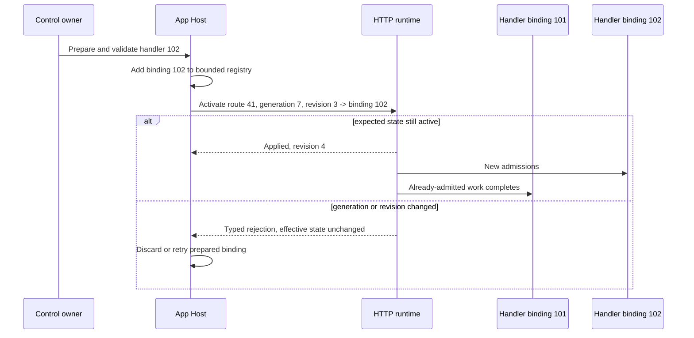
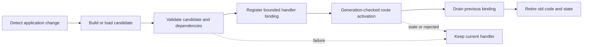

# Handler Swap And Hot Reload

CoAkka HTTP Runtime can switch a stable route to a prepared handler binding
while the service remains running. The operation is atomic at the route
boundary, generation checked, revision checked, idempotent, and safe for
requests already in flight.

This is a real handler-swap capability and the safe activation foundation for
hot reload. The current runtime does not watch source files or compile
application code by itself; an App Host or addon supplies that developer
workflow above the activation primitive.

## Contents

- [What Changes Live](#what-changes-live)
- [Handler Swap Flow](#handler-swap-flow)
- [Correctness Contract](#correctness-contract)
- [Application Workflow](#application-workflow)
- [Hot Reload Boundary](#hot-reload-boundary)
- [Language API Map](#language-api-map)
- [What Requires A New Service](#what-requires-a-new-service)
- [Operational Checklist](#operational-checklist)

## What Changes Live

A handler swap changes only the binding selected by one existing route. The
route ID, method, path pattern, body policy, and structural route generation
remain stable.

This is the runtime primitive needed by development reload, feature rollout,
canary logic, or a control-plane activation. File watching, compilation,
module/class loading, feature evaluation, and authorization of the change stay
in the App Host or an addon.

## Handler Swap Flow



## Correctness Contract

The activation command carries:

| Field | Purpose |
| --- | --- |
| Activation ID | Makes a repeated command return the retained outcome instead of applying twice |
| Expected route generation | Prevents a handler update against a different route table |
| Route ID | Names the stable route being changed |
| Expected binding revision | Prevents lost updates between concurrent control owners |
| New handler binding ID | Names a handler already prepared by the App Host |

The runtime captures the binding ID when a request is admitted. Dispatch never looks
up a mutable "current handler" after admission. That rule lets old and new
handlers coexist briefly without sending an in-flight request to the wrong
version.

A rejected activation preserves the entire previous route/binding state. The
outcome reports the effective generation and revision so the caller can decide
whether to refresh, retry, or abandon the change.

## Application Workflow

```text
1. Build or load the new handler outside the HTTP event loop.
2. Validate configuration and application dependencies.
3. Add it to a bounded App Host binding registry.
4. Read the current route generation and binding revision.
5. Submit one activation with a unique activation ID.
6. Check the typed outcome; never infer success from a returned call alone.
7. Send new traffic to the accepted binding.
8. Retain the old binding until every request that captured it terminalizes.
9. Remove old code/state only after the drain bound is satisfied.
```

The binding registry, loader, and in-flight counts are App Host responsibilities.
The runtime owns admission identity, the atomic switch, stale-update rejection,
and the effective-state outcome.

After the App Host has registered binding `102`, Python activates it like this:

```python
from coakka_http import ResultCode, RouteRebind


outcome = runtime.rebind(
    RouteRebind(
        activation_id=9001,
        expected_route_generation=7,
        route_id=41,
        expected_binding_revision=3,
        new_handler_binding_id=102,
    ),
    timeout_ms=2_000,
)

if outcome.code != ResultCode.OK:
    raise RuntimeError(f"handler activation rejected: {outcome.code}")
if outcome.effective_handler_binding_id != 102:
    raise RuntimeError("unexpected effective handler binding")
```

`changed` distinguishes a new activation from an idempotent replay. In either
case, the effective route generation, binding ID, and binding revision in the
outcome are the state the caller should retain.

## Hot Reload Boundary

A development or production reload owner can implement this bounded sequence:



The runtime owns the atomic activation and in-flight request identity. The App Host or
addon owns file watching, compilation, module/class loading, validation,
rollback policy, and the lifetime of loaded code. This separation allows a
Spring-like development reload, JavaScript module reload, Python module loader,
or Go/native deployment controller without weakening the shared route law.

## Language API Map

| Language | Activation API | Command value |
| --- | --- | --- |
| C/C++ | `coakka_http_core_rebind` | `coakka_http_route_rebind_t` |
| Java/Kotlin | `HttpCore.rebind(...)` | `RouteRebind` |
| Python | `runtime.rebind(...)` | `RouteRebind` |
| JavaScript/TypeScript | `runtime.rebind(...)` | Plain object with activation/generation/route/revision/binding fields |
| Go | `runtime.Rebind(...)` | `RebindRequest` |

Use the complete `CoAkka HTTP Runtime` surface for live activation. A
small buffered convenience builder may intentionally freeze its handler map
for its whole service lifetime.

## What Requires A New Service

The current handler activation does not change:

- route method, pattern, captures, body policy, or static mounts;
- listener address, port, HTTP protocol, or I/O backend;
- TLS/mTLS mode, certificate, key, trust roots, or credential generation;
- construction-time queue, connection, byte, event, or thread reservations;
- application binaries that the App Host cannot load safely in place.

Build a new validated service instance for those changes, move traffic, and
drain the old owner within a finite deadline.

## Operational Checklist

- Bound prepared, active, draining, and retained handler versions.
- Serialize or compare-and-apply concurrent control requests.
- Use a unique activation ID and persist the accepted outcome when the control
  plane can retry.
- Export route generation, binding revision, applied/rejected activation count,
  old-binding in-flight work, and drain latency.
- Exercise stale generation, stale revision, duplicate activation, invalid
  binding, pressure, shutdown overlap, and rollback cases.
- Never unload code or destroy handler state while a captured request can still
  reach it.
