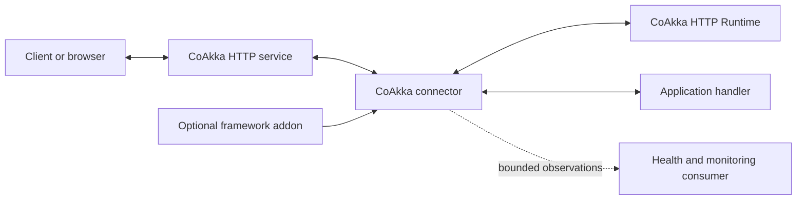
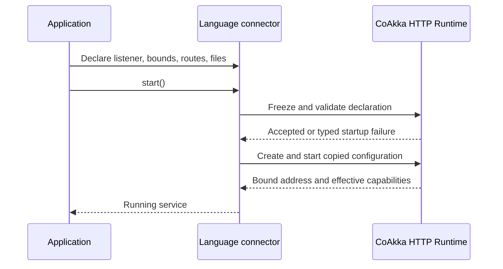
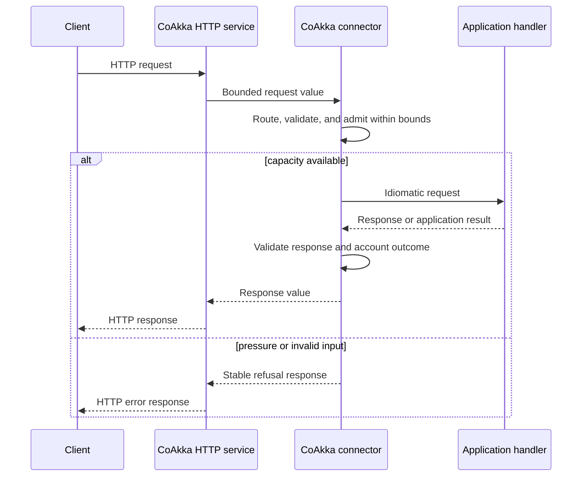
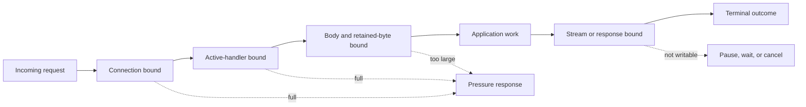
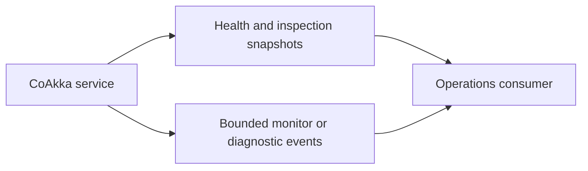
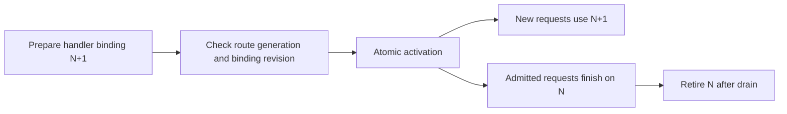
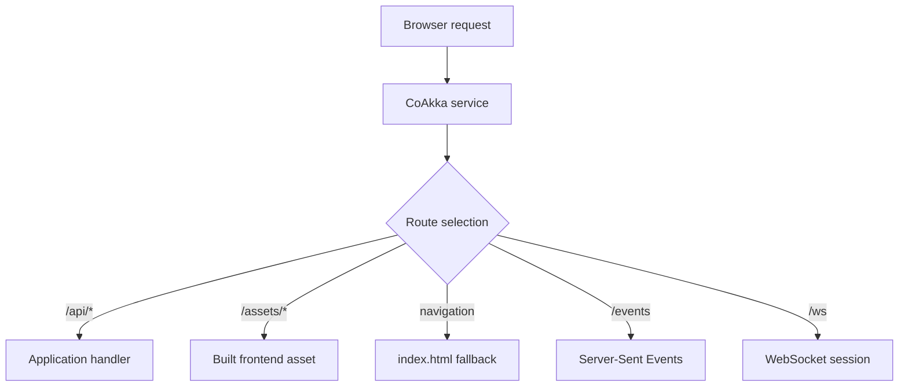
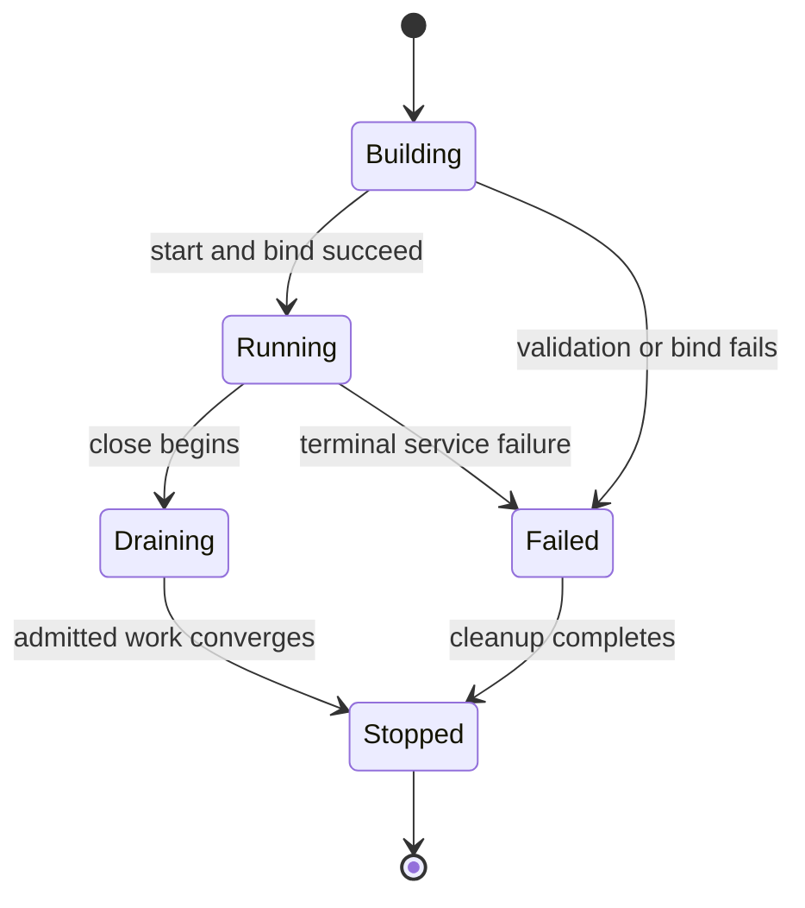

# How CoAkka HTTP Runtime Works

CoAkka keeps application handlers inside their native language environment
while giving every connector the same bounded HTTP service contract.
Applications use the ordinary public service API for their language; they do
not select an execution mode.

## Contents

- [The Four Parts](#the-four-parts)
- [Startup](#startup)
- [Request And Reply](#request-and-reply)
- [Pressure And Backpressure](#pressure-and-backpressure)
- [Security And Protocol](#security-and-protocol)
- [Monitoring](#monitoring)
- [Live Handler Changes](#live-handler-changes)
- [Frontend And Backend](#frontend-and-backend)
- [Lifecycle](#lifecycle)
- [What Changes By Language](#what-changes-by-language)

## The Four Parts



| Part | Responsibility |
| --- | --- |
| App Host | Language runtime, application scheduling, business state, handlers, and downstream resources |
| Language package | Idiomatic builders, service ownership, value conversion, handler dispatch, and lifecycle projection |
| `CoAkka HTTP Runtime` | HTTP resources, protocols, routing, files, outbound I/O, capacity, pressure, observability, monitoring, and shutdown |
| Application | Business behavior and downstream resource limits |
| Addon | Optional annotations, decorators, middleware conventions, validation, dependency injection, or generated routes |

The convenience builder covers ordinary buffered request/reply. The advanced
service owner in the same package opens streaming, realtime, files, outbound HTTP,
TLS/mTLS, live handler changes, and monitor control. Both use the same contract;
the application chooses the amount of control it needs.

## Startup



The mutable builder is consumed once. Invalid routes, impossible limits, or an
unavailable listener fail before the service is reported ready. A benchmark
must start this same public service.

## Request And Reply



Handlers stay ordinary language code. Go handlers receive Go values, JVM
handlers receive JVM-owned values, Python handlers are normal async functions,
and JavaScript handlers run as JavaScript functions on Node.js or Bun.

## Pressure And Backpressure

Capacity is finite at every retained-resource boundary that the host exposes.
The exact mechanics vary, but the observable law does not.



A connector may use a bounded dispatch queue, a semaphore-style active-handler
limit, host event-loop admission, or transport pause/resume. Documentation must
name the host-specific mechanism instead of pretending every language has the
same queue. Pressure, timeout, cancellation, closed state, and application
failure remain distinguishable.

## Security And Protocol

```mermaid
sequenceDiagram
    participant A as Application
    participant X as Language connector
    participant C as CoAkka HTTP Runtime
    participant P as Client peer

    A->>X: Listener + protocol + TLS/mTLS identity
    X->>C: Copy and validate configuration
    C->>C: Check capabilities and resource bounds
    C->>P: Bind and negotiate
    alt valid configuration and trusted peer
        C-->>X: Ready with bound address
    else invalid, unsupported, or untrusted
        C-->>X: Typed failure; no partial ready state
    end
```

TLS and mutual TLS are listener policies, not middleware. The runtime owns the
connection-level handshake and fail-closed validation. The App Host or an addon
uses verified identity for application authorization. Protocol and I/O backend
selection happen before start; see [TLS And mTLS](tls-and-mtls.md).

## Monitoring



Every complete runtime connector exposes health, liveness, bounded aggregates,
monitor policy, cursor-based event pages, missed-history truth, and a finite
wait/interrupt lifecycle. The small convenience builders may expose only the
health and diagnostics needed for buffered services. Monitoring is disabled by
default and never retains traffic payloads or credentials. See
[Observability And Monitoring](observability-and-monitoring.md).

## Live Handler Changes



The App Host loads and validates code before activation. The runtime applies the
binding change only when the expected route generation and current revision
still match. A stale or invalid activation leaves the previous state unchanged;
already-admitted requests never jump to a different handler. See
[Live Handler Changes](handler-swap-and-hot-reload.md).

## Frontend And Backend



Explicit application routes win before SPA fallback. This lets one service own
the browser application, API, streams, and realtime endpoints without asking
the user to operate a second HTTP server.

## Lifecycle



Close is finite and idempotent. It stops new admission, cancels or drains work
according to the connector contract, closes upgraded sessions, wakes waiters,
and releases host resources only after callers can no longer reach them.

## What Changes By Language

| Concern | Shared contract | Host-specific expression |
| --- | --- | --- |
| Routes and bounds | Frozen and validated before ready | Builder names and value types |
| Handler execution | Bounded and observable | Threads, event loop, goroutines, or async tasks |
| Pressure | Explicit refusal or pause | Error type, status, callback, or awaitable |
| Monitoring | Finite state and honest loss reporting | Language-specific snapshot, cursor page, wait, and interrupt methods |
| Shutdown | Stop admission and converge owned work | `context`, future, coroutine, promise, or explicit C lifecycle |
| Framework style | Optional addon above the connector | Annotations, decorators, middleware, generated routes |

Continue with [App Host And Connectors](app-host-and-connectors.md),
[Operations](operations.md), or [Frontend And Backend](frontend-and-backend.md).
