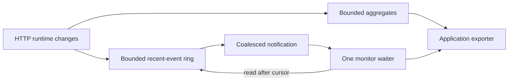

# Observability And Monitoring

CoAkka HTTP Runtime makes runtime state inspectable without turning the request
path into a logging callback. Health, liveness, aggregates, recent operational
events, configuration generations, and loss accounting are part of the
`CoAkka HTTP Runtime` contract.

## Contents

- [Two Different Responsibilities](#two-different-responsibilities)
- [What You Can Observe](#what-you-can-observe)
- [Supported Monitor Categories](#supported-monitor-categories)
- [How The Monitor Channel Works](#how-the-monitor-channel-works)
- [Configure Collection](#configure-collection)
- [Run An Operator Loop](#run-an-operator-loop)
- [Language API Map](#language-api-map)
- [Data And Security Boundary](#data-and-security-boundary)
- [Operational Guidance](#operational-guidance)

## Two Different Responsibilities

| Term | Meaning in CoAkka | Typical question |
| --- | --- | --- |
| Observability | Truth exposed by the running service | Is it ready? Is the event loop making progress? How many exchanges and client calls are active? |
| Monitoring | The bounded mechanism that selects, retains, and delivers operational observations | Which categories are collected? How many recent events remain? Did the reader miss history? |

Observability remains useful even when monitor collection is disabled. Health
and liveness are direct service observations. Monitoring adds selected
aggregates, latency buckets, failure counts, and a recent-event channel whose
cost is reserved and bounded.

## What You Can Observe

The complete runtime surface exposes:

- non-blocking health and a bounded fresh-progress liveness probe;
- admitted request and request-byte counts;
- completed, failed, timed-out, disconnected, and cancelled exchanges;
- response counts by status family;
- bounded failure counts and fixed latency buckets;
- active server exchanges, active client calls, ready client terminals, and
  retained client bytes through the health snapshot;
- active monitor configuration, generation, collection epoch, and change
  sequence;
- retained-event occupancy, overwrite/drop counts, and notification health;
- event sequence, category, failure reason, exchange identity, and bounded
  runtime-safe detail.

These values distinguish an unhealthy service from a healthy service under
load, and a slow application from runtime failures, timeouts, disconnects, or
monitor-reader lag. Bounded queues and backpressure remain part of the HTTP
service contract: capacity is configured up front, overload is rejected with
typed outcomes, and connector-level pressure can be exported alongside runtime
monitor values. The current runtime monitor does not claim a queue-depth producer.

## Supported Monitor Categories

The current runtime implementation produces these aggregate categories:

| Category | Aggregate data |
| --- | --- |
| `LIFECYCLE` | Lifecycle changes and progress state |
| `CONFIG` | Effective policy generation, epoch, and change sequence |
| `TRAFFIC` | Admitted request and request-byte counts |
| `EXCHANGE` | Completed and terminal exchange counts |
| `FAILURE` | Bounded counts grouped by stable failure reason |
| `RESPONSE` | Response counts grouped by status family |
| `LATENCY` | Fixed, pre-reserved latency buckets |

The recent-event channel currently emits `LIFECYCLE`, `CONFIG`, `EXCHANGE`,
and `FAILURE` events. The configuration snapshot's `supported_categories`
field is authoritative. Names present in a language enum but absent from that
mask are reserved for compatible expansion; selecting one is rejected with
`UNSUPPORTED_CATEGORY` and leaves the previous policy unchanged.

## How The Monitor Channel Works



The notification is a doorbell, not the data itself. After a wakeup, the
consumer reads an immutable snapshot and/or a bounded page after its last
sequence. Multiple notifications may coalesce without losing aggregate truth.

Only one blocking waiter owns the monitor wait lane for a runtime instance.
Snapshot reads are independent and can be made by multiple readers. On
shutdown, the owner interrupts the waiter, joins it, then closes the runtime.

If the event ring overwrites old entries, the next page reports
`missed_events`; it never presents an incomplete interval as complete. Monitor
saturation, overwrite, or notification failure does not block HTTP work and
does not change a request outcome.

## Configure Collection

For the packaged host-inlined service, start with the
[Service monitoring guide](https://github.com/phuong-tran/coakka-samples/blob/main/coakka-http-runtime/monitoring.md).
It covers builder configuration, typed live-policy outcomes and source recipes
for C/C++, Go, Java/Kotlin, Python, Node.js and Bun. The lower-level runtime
example below is not the first-run application recipe.

Monitoring is disabled by default. Reserve the maximum memory shape at startup,
then optionally change the active policy within that reservation. This Python
example reserves 256 event slots, runtime-safe detail, signal notification,
and fixed latency buckets:

```python
from coakka_http import (
    Configuration,
    Listener,
    MonitorCategory,
    MonitorCollection,
    MonitorOptions,
)


aggregate_categories = (
    MonitorCategory.LIFECYCLE
    | MonitorCategory.CONFIG
    | MonitorCategory.TRAFFIC
    | MonitorCategory.EXCHANGE
    | MonitorCategory.FAILURE
    | MonitorCategory.RESPONSE
    | MonitorCategory.LATENCY
)
event_categories = (
    MonitorCategory.LIFECYCLE
    | MonitorCategory.CONFIG
    | MonitorCategory.EXCHANGE
    | MonitorCategory.FAILURE
)

with Configuration() as configuration:
    configuration.add_listener(Listener(port=8080))
    configuration.set_monitor(
        MonitorOptions(
            collection=MonitorCollection.AGGREGATES_AND_EVENTS,
            event_capacity=256,
            max_events_per_read=64,
            detail_bytes_per_event=128,
            latency_bucket_count=16,
            aggregate_categories=aggregate_categories,
            event_categories=event_categories,
            signal_reserved=True,
            runtime_safe_detail=True,
            fixed_latency_buckets=True,
        )
    )
    runtime = configuration.create_core()

runtime.start()
```

Live policy changes use the expected configuration generation. A rejected
update returns a typed outcome and leaves the complete prior policy active.
It cannot grow event, detail, or histogram storage beyond the startup
reservation. In Python, read `runtime.monitor_config()`, construct a
`MonitorPolicy`, then call `runtime.monitor_apply(current.generation, policy)` and
check its `MonitorApplyReason` before treating the update as active.

## Run An Operator Loop

```python
from threading import Event, Thread


stop_monitor = Event()


def export_monitor() -> None:
    cursor = 0
    while not stop_monitor.is_set():
        if not runtime.monitor_wait(1_000):
            continue

        snapshot = runtime.monitor_snapshot()
        export_snapshot(snapshot)

        page = runtime.monitor_read(cursor, 64)
        if page.missed_events:
            report_monitor_gap(page.missed_events)
        for event in page.events:
            export_event(event)
        cursor = page.latest_sequence


monitor_thread = Thread(target=export_monitor, name="http-monitor")
monitor_thread.start()

# Stop admission while application readers continue accepted work. The monitor
# remains active so it can observe the drain interval.
runtime.drain()
wait_for_application_drain()

# The lifecycle owner then stops this monitor reader in order.
stop_monitor.set()
runtime.monitor_interrupt()
monitor_thread.join(timeout=5)
if monitor_thread.is_alive():
    raise RuntimeError("monitor reader did not stop")
runtime.stop()
runtime.close()
```

The application decides how to export the copied values to Prometheus,
OpenTelemetry, logs, a local dashboard, or another operations system. Exporter
network I/O, batching, retries, and credentials remain outside the HTTP event
loop and must have their own finite queue and deadline.

## Language API Map

| Language | Health and liveness | Aggregates and policy | Event channel |
| --- | --- | --- | --- |
| C/C++ | `coakka_http_host_service_health`, `coakka_http_host_probe_liveness` | `coakka_http_host_monitor_config`, `coakka_http_host_monitor_snapshot`, `coakka_http_host_monitor_apply` | `coakka_http_host_monitor_read`, `coakka_http_host_monitor_wait`, `coakka_http_host_monitor_interrupt` |
| Java/Kotlin | `health()`, `probeLiveness()` | `monitorConfiguration()`, `monitorSnapshot()`, `applyMonitorPolicy()` | `readMonitorEvents()`, `waitForMonitor()`, `interruptMonitorWaiter()` |
| Python | `health()`, `probe_liveness()` | `monitor_config()`, `monitor_snapshot()`, `monitor_apply()` | `monitor_read()`, `monitor_wait()`, `monitor_interrupt()` |
| JavaScript/TypeScript | `health()`, `probeLiveness()` | `monitorConfig()`, `monitorSnapshot()`, `monitorApply()` | `monitorRead()`, `monitorWait()`, `monitorInterrupt()` |
| Go | `Health()`, `ProbeLiveness()` | `MonitorConfig()`, `MonitorSnapshot()`, `ApplyMonitorPolicy()` | `ReadMonitorEvents()`, `WaitMonitor()`, `InterruptMonitor()` |

These methods belong to the complete runtime surface. Convenience builders may
expose a smaller health or diagnostic view for ordinary buffered services.

## Data And Security Boundary

Monitor storage never retains request or response bodies, headers, cookies,
tokens, private keys, certificates, peer-certificate material, or arbitrary
application labels. Runtime-safe detail is bounded and describes operational
state; it is not a traffic capture facility.

Inspection and monitoring also have different jobs. Monitoring observes the
local service within its reserved categories. Any externally reachable
inspection product requires its own authentication, response bounds, cache,
and deployment policy.

## Operational Guidance

- Keep monitoring disabled when it is not needed, or select only categories
  used by an alert or dashboard.
- Export aggregate deltas at a steady interval; do not scrape in a tight loop.
- Alert on failures, timeouts, p99 latency, event overwrite, missed history,
  signal failure, and stale/partial snapshots.
- Export typed queue rejection and connector queue pressure beside runtime
  monitoring; do not infer queue depth from an unsupported monitor category.
- Treat liveness as fresh runtime progress, not merely a process that still
  owns a socket.
- Keep the exporter queue finite and surface exporter drops separately.
- Record monitor generation and collection epoch with exported values so a
  policy change is visible in the time series.
