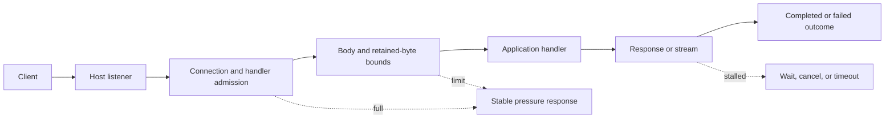
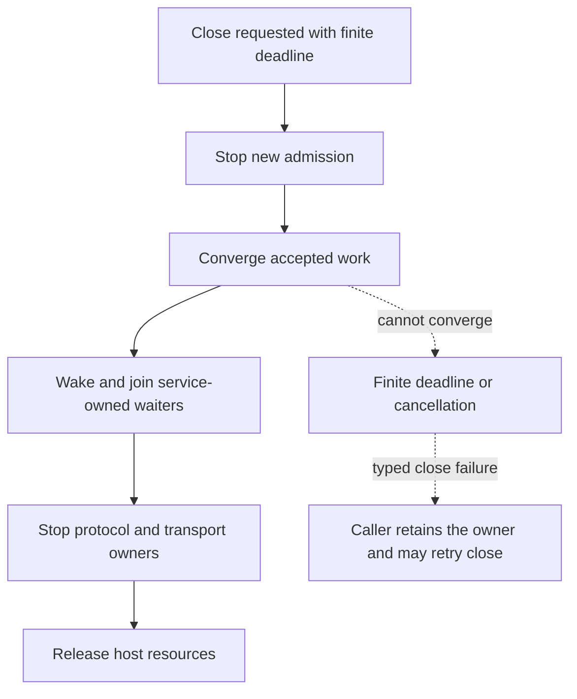

# CoAkka HTTP Runtime Operations

This guide describes capacity, pressure, observability, monitoring, and shutdown for the
public CoAkka services. Host mechanics differ; observable behavior must
remain bounded and explicit.

## Contents

- [Ownership](#ownership)
- [Bounded Resources](#bounded-resources)
- [Pressure Path](#pressure-path)
- [Streaming Backpressure](#streaming-backpressure)
- [Observability And Monitoring](#observability-and-monitoring)
- [Failure Outcomes](#failure-outcomes)
- [Shutdown](#shutdown)
- [Shutdown trade-offs](#shutdown-trade-offs)
- [Application hooks](#application-hooks)
- [Deployment without Kubernetes](deployment-without-kubernetes.md)
- [Operational Checklist](#operational-checklist)

## Ownership

| Owner | Responsibility |
| --- | --- |
| App Host | Application scheduling, process signals, handlers, and downstream resources |
| `CoAkka HTTP Runtime` | HTTP resources, protocol state, admission, files, outbound work, monitoring, and ordered shutdown |
| Language connector | Service declaration, route binding, request/response projection, and language lifecycle |
| Application | Handler state, downstream calls, executors, pools, and business cancellation |
| Addon | Optional framework conventions above the connector |

The connector owns a successfully started service until close completes. The
application owns downstream work after the handler starts it and must not let
that work outlive resources it still references.

## Bounded Resources

A production configuration accounts for all retained work, not only request
count.

| Group | Typical limits |
| --- | --- |
| Listener | Connections, header bytes, request-target bytes, idle/header timeouts |
| Handler | Active handlers and, where used, dispatch items and retained bytes |
| Request | Body bytes, form fields, multipart parts, stream chunks and queued bytes |
| Response | Body bytes, headers, stream chunks and write/cancellation lifetime |
| Realtime | Server-event bytes, WebSocket sessions, messages and buffered bytes |
| Files | Static mounts, confined roots, active reads and response bytes |
| Outbound | In-flight requests, response bytes, redirects and timeouts |
| Observability | Health, liveness, failure rows, latency buckets, snapshots, retained events and detail bytes |
| Lifecycle | Startup, wait, drain, cancellation and close deadlines |

Defaults should serve the common request/reply case without requiring users to
tune every value. Advanced limits remain available for measured workloads and
small devices.

## Pressure Path



One owner decides admission at each boundary. Refused work does not become a
hidden queued request. Accepted work reaches completion, failure, timeout,
cancellation, disconnect, or service stop.

Not every connector has a dispatch queue. Where a queue exists, both item count
and retained bytes must be finite. Where it does not, active-handler or
event-loop admission provides the bound. Application queues and database pools
remain the application's responsibility.

## Streaming Backpressure

Request and response streaming use separate budgets. A consumer must not retain
chunks without a bound. A producer that cannot write immediately pauses for
writability, observes cancellation, or reaches its own monotonic deadline; it
does not busy-loop.

For event-loop hosts, long CPU or blocking I/O work must move to the host's
normal bounded worker/task facility. For Go, goroutines and channels created by
the application also need explicit ownership and capacity.

## Observability And Monitoring

Health answers whether the service is running, ready, and accepting work.
Liveness additionally requires fresh bounded progress from the runtime loop.
Snapshots answer what the service is doing: admitted bytes, completed/failed/
timed-out/cancelled exchanges, status families, active resources, route
and monitor-policy generations, latency, and retained operational history.
Route/binding revisions come from live-activation outcomes. Queue pressure is
reported by typed admission results and connector diagnostics; it is not
inferred from a runtime monitor category that the loaded package does not support.

Monitoring forms are different and must be named correctly:

- a snapshot is a point-in-time bounded value;
- diagnostic polling consumes bounded retained failures;
- the runtime monitor event channel has finite storage and one blocking waiter;
- missed or overwritten event history must be reported explicitly;
- monitoring must not retain request bodies, credentials, or application
  payloads.

The complete C/C++, JVM, Python, JavaScript/TypeScript, and Go runtime surfaces all
project monitor configuration, snapshots, live policy, cursor reads, loss
counts, wait, and interrupt. Convenience builders intentionally expose only the
subset needed by their buffered service. See
[Observability And Monitoring](observability-and-monitoring.md).

## Failure Outcomes

Applications and operations should keep these outcomes distinct:

| Outcome | Meaning |
| --- | --- |
| Pressure | A finite capacity is full now |
| Limit | Input exceeds a configured item or byte ceiling |
| Timeout | A monotonic progress deadline expired |
| Cancellation | Client, application, or lifecycle cancelled owned work |
| Closed | Service or stream no longer accepts work |
| Unsupported | The selected host package does not expose the capability |
| Application failure | Handler or downstream business work failed |
| Service failure | Listener or service owner reached a terminal error |

Collapsing these into one generic exception destroys retry and operational
information.

## Shutdown



Close is serialized and idempotent. A timed-out close reports failure without
releasing memory or state still reachable by live handlers. Signal ownership is
opt-in; importing a connector does not silently take over the process.

The normal service surface owns this sequence through its close contract; do
not invent a separate `drain()` method for a connector that does not expose one.
Removing a replica from ingress is a deployment action before service close,
not a substitute for Core's admission and cleanup work. Keep dependencies
needed by accepted handlers alive until their work has settled.

## Shutdown trade-offs

| Choice | Benefit | Cost or limitation |
| --- | --- | --- |
| Drain accepted work | Reduces interrupted requests and gives owned resources an orderly end | Holds CPU/memory/connections during rollout; completion is not guaranteed before the deadline. |
| Finite deadline | Bounds the graceful attempt and exposes stuck work | Some long-running requests or sessions may not finish; inspect the outcome rather than reporting success. |
| Replacement before old-instance drain | Keeps new traffic served while the old instance retires | Requires spare capacity and ingress coordination; not an atomic cluster-wide operation. |
| Force termination as an operator escalation | Ends a process that cannot converge | Can interrupt responses and business work; bypasses graceful cleanup and cannot guarantee delivery or rollback. |

A completed business side effect may still have a lost HTTP response. Clients
need application-defined idempotency and retry policy; drain does not create
exactly-once business execution. SSE/WebSocket applications need bounded drain
and reconnect/resume policy rather than an unlimited shutdown wait.

## Application hooks

A hook is the application's bridge from process termination intent to its
existing service owner. It is not a handler invoked by Core for every request.
Install it before publishing readiness; importing a connector should not take
over process signals. Keep one cleanup owner, preserve errors and avoid racing
several independent close sequences.

The [Kotlin main sample](https://github.com/phuong-tran/coakka-samples/blob/main/coakka-http-runtime/kotlin/src/main/kotlin/sample/Main.kt)
uses this coordination excerpt (the latches are declared in `main`):

```kotlin
Runtime.getRuntime().addShutdownHook(Thread {
    stopped.countDown()          // Ask the main lifecycle owner to stop.
    shutdownCompleted.await()    // Keep the hook alive until cleanup is reported.
})
```

The main path waits on `stopped`, then closes the service in `finally`. It
releases `shutdownCompleted` in a nested `finally`, including on close failure;
the latch means the cleanup attempt ended, not that it succeeded. The sample
prints its success marker only after close succeeds and preserves the original
failure with cleanup errors attached. See the complete source for ordering and
its second, upstream service owner; this excerpt is not standalone code.

This coordination latch has no independent timeout in the sample. Core close
has its own contract, but that does not bound arbitrary application cleanup.
A deployment must supply an outer process-stop budget covering ingress
withdrawal, drain and application cleanup, and define what happens if that
budget expires. A forced kill or machine loss can bypass hooks entirely.
Do not call process exit from a hook or depend on unspecified ordering between
independent hooks. Register application cleanup in an explicit owner order.

Go, Python and Node/Bun use their language's termination handling to request
the same lifecycle sequence; they do not emulate JVM shutdown hooks. See each
[integration guide](https://github.com/phuong-tran/coakka-samples/blob/main/coakka-http-runtime/README.md#languages)
for its concrete signal/close recipe. Stop and join any application-owned
monitor reader before freeing the service it reads; retain resources still
reachable by a failed close. Do not convert a timeout to a successful stop.

## Operational Checklist

- Size connections, active handlers, bodies, streams, sessions, and retained
  diagnostics from the device budget.
- Keep application executors, goroutines/tasks, database pools, and retries
  finite.
- Treat pressure and writability as normal control flow.
- Export health and fresh liveness separately from traffic and failure counters.
- Track monitor generation, collection epoch, overwrite/drop, and missed history.
- Use monotonic deadlines for handler work, streams, outbound calls, and close.
- Test overload, disconnect, cancellation, and shutdown with the same
  application package used by the application.
- Alert on rejection, p99 latency, retained bytes, active work, missed monitor
  history, stop latency, threads, and descriptors.
