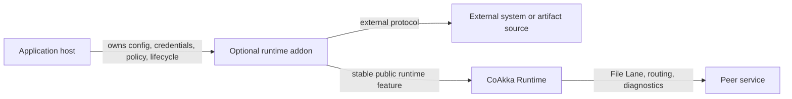
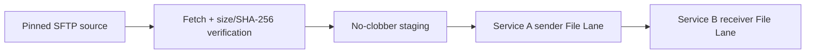

# Runtime Addons

Runtime addons are optional, independently released capabilities that compose
with CoAkka Runtime without becoming part of runtime core or the default runtime
package. Each addon owns one focused external workflow or protocol family and
uses stable runtime features such as File Lane when distribution is needed.

> **Current status:** Eleven artifact source addons are public at
> `1.1.0+d1032f6d` and require Runtime native `2.4.0` or newer. SFTP is public
> at replacement coordinate `1.2.0+88b9a047` and requires Runtime native
> `2.3.0` or newer. All remain separate from default Runtime and connector
> packages.

## Where Addons Fit



The host starts Runtime and explicitly starts the addon it selected. Runtime
does not discover every external protocol, own addon credentials, or absorb
addon policy. The addon owns its protocol mechanics and bounded workflow while
Runtime keeps ownership of routing, lane semantics, lifecycle contracts,
deadletters, and runtime diagnostics.

This separation keeps ordinary runtime consumers small and predictable:

- users who do not need an addon do not receive its dependencies or workers;
- one addon does not become a collection of unrelated protocols;
- addon and runtime versions can advance independently;
- external protocol code does not widen the runtime core ABI;
- a release can be audited and rolled back without replacing Runtime.

## When To Use One

Use a runtime addon when an application host needs a reusable external
capability that is broader than one app's helper function but does not belong in
runtime core. Examples include acquiring a verified artifact from SFTP and then
publishing it through File Lane, or a future storage integration with its own
credentials, retry policy, and protocol-specific failure model.

Keep the workflow in the app host when it is application-specific, has no
stable cross-service contract, or does not benefit from a separately versioned
and audited native capability. Do not add a protocol to an existing addon only
because both protocols move files; separate dependencies, security models, and
failure semantics should remain separate addon products.

## Package And Compatibility Contract

A promoted addon is a separate archive under:

```text
runtime-addons/<addon>/native/releases/<release>/
```

Its manifest declares:

- addon identity and independent version;
- required runtime ABI major and minimum native runtime version;
- required public runtime features;
- exact native platforms and exported C symbols;
- owned native dependencies and matching-host evidence;
- the archive digest and install metadata.

The archive contains the addon, not another copy of CoAkka Runtime. Protocol,
crypto, and compression dependencies must be self-contained when their licenses
permit it; target users must not be asked to install ambient implementation
libraries. Operating-system libraries remain explicit platform dependencies.

Never infer availability from a source directory or package template. A runtime
addon is installable only when its immutable archive appears in
[`artifacts/public-artifacts.tsv`](https://github.com/phuong-tran/coakka-publish/blob/main/artifacts/public-artifacts.tsv)
with its manifest and `SHA256SUMS`.

## Current Addon Lanes

| Addon | Workflow | Public status |
| --- | --- | --- |
| [HTTPS](https://github.com/phuong-tran/coakka-publish/tree/main/runtime-addons/artifact-publisher-https) | Immutable URL, size and SHA-256 verification, no-clobber staging. | `1.1.0+d1032f6d`, five targets. |
| [S3 / MinIO](https://github.com/phuong-tran/coakka-publish/tree/main/runtime-addons/artifact-publisher-s3) | Version-pinned object with SigV4. | `1.1.0+d1032f6d`, five targets. |
| [Local Drop](https://github.com/phuong-tran/coakka-publish/tree/main/runtime-addons/artifact-publisher-local-drop) | Stable file under an anchored local directory. | `1.1.0+d1032f6d`, Linux ARM64/x86-64 and macOS ARM64. |
| [Azure Blob](https://github.com/phuong-tran/coakka-publish/tree/main/runtime-addons/artifact-publisher-azure-blob) | Immutable blob version through caller-minted service SAS. | `1.1.0+d1032f6d`, five targets. |
| [Google Cloud Storage](https://github.com/phuong-tran/coakka-publish/tree/main/runtime-addons/artifact-publisher-gcs) | Generation-pinned object through caller-minted V4 signed URL. | `1.1.0+d1032f6d`, five targets. |
| [WebDAV](https://github.com/phuong-tran/coakka-publish/tree/main/runtime-addons/artifact-publisher-webdav) | Strong-ETag-pinned HTTPS resource. | `1.1.0+d1032f6d`, five targets. |
| [OCI Distribution](https://github.com/phuong-tran/coakka-publish/tree/main/runtime-addons/artifact-publisher-oci-registry) | Digest-addressed registry blob. | `1.1.0+d1032f6d`, five targets. |
| [Hugging Face Hub](https://github.com/phuong-tran/coakka-publish/tree/main/runtime-addons/artifact-publisher-huggingface-hub) | Full-commit-pinned Hub file with credential-isolated redirect. | `1.1.0+d1032f6d`, five targets. |
| [GitHub Release](https://github.com/phuong-tran/coakka-publish/tree/main/runtime-addons/artifact-publisher-github-release) | Numeric-ID release asset with credential-isolated redirect. | `1.1.0+d1032f6d`, five targets. |
| [Google Drive](https://github.com/phuong-tran/coakka-publish/tree/main/runtime-addons/artifact-publisher-google-drive) | Retained blob revision through OAuth. | `1.1.0+d1032f6d`, five targets. |
| [Dropbox](https://github.com/phuong-tran/coakka-publish/tree/main/runtime-addons/artifact-publisher-dropbox) | Exact object revision through OAuth. | `1.1.0+d1032f6d`, five targets. |
| [SFTP](https://github.com/phuong-tran/coakka-publish/tree/main/runtime-addons/artifact-publisher-sftp) | Host-key-pinned acquisition with size and SHA-256 verification. | Replacement `1.2.0+88b9a047`, five targets. |

The archives expose small reviewed C ABIs. Go, Swift, JVM, Node, Python,
.NET, and other connector wrappers are future independent slices, not part of
these coordinates.

The SFTP workflow composes existing boundaries:



Fetching alone is not a successful publish. The addon reaches aggregate
success only after the verified artifact has reached the required File Lane
terminal outcomes. The app host still owns credentials, authorization grants,
business retry/rollout policy, and the lifecycle ordering of Runtime, File Lane,
and the addon.

## Release Evidence

Every advertised platform needs matching-host module execution and dynamic
dependency inspection. Cross-compilation proves that an artifact can be built;
it does not prove that it loads, transfers data, cancels, or shuts down on that
platform. Package templates and source candidates must stay visibly distinct
from promoted public coordinates.

The current immutable coordinates are:

```text
runtime-addons/artifact-publisher-<source>/native/releases/1.1.0+d1032f6d/
  coakka-runtime-addon-artifact-publisher-<source>-native-1.1.0.tar.gz
runtime-addons/artifact-publisher-sftp/native/releases/1.2.0+88b9a047/
  coakka-runtime-addon-artifact-publisher-sftp-native-1.2.0.tar.gz
```

Matching-host evidence covers every packaged module, reviewed exports, dynamic
dependencies, protocol failures, cancellation and shutdown, integrity,
no-clobber staging, and File Lane delivery. Windows SFTP staging rejects
reparse roots. Linux family evidence covers ASan/LSan, UBSan, and TSan; static
analysis and strict warning gates cover production and test sources. Live
vendor-account certification and performance SLAs are not claimed.

For exact current coordinates, read [Current Packages](current-packages.md).
For ownership across repositories, read
[Repository Boundaries](repository-boundaries.md).
